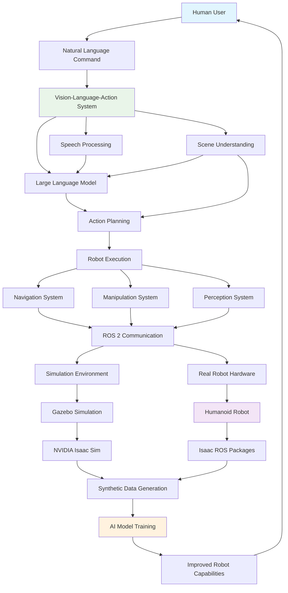

# Introduction to Physical AI & Humanoid Robotics

Welcome to the exciting world of Physical AI and Humanoid Robotics! This book is designed to guide you through the fundamental concepts and practical applications of bringing intelligent machines to life. You'll learn how robots perceive their environment, make decisions, and interact with the physical world, focusing specifically on humanoid forms.

## Book Architecture Overview

This diagram illustrates the interconnected nature of the systems covered in this book, from natural language interaction to AI-powered robot execution.

## What You Will Learn

Throughout this book, you will explore:

*   **The Robotic Nervous System (ROS 2)**: Understand the core framework that allows robots to communicate and operate.
*   **Digital Twin Simulation (Gazebo)**: Learn to create and simulate virtual robots in realistic environments.
*   **AI-Robot Brain (NVIDIA Isaac + Isaac ROS)**: Discover how AI powers robot perception, mapping, and navigation.
*   **Vision-Language-Action Robotics (VLA)**: Explore how robots can understand natural language and perform complex tasks.

## Who Is This Book For?

This book is perfect for:

*   Students in grades 5-8 with an interest in robotics, AI, and computer science.
*   Educators looking for engaging material to teach physical AI concepts.
*   Beginners who want to get hands-on experience with ROS 2, Gazebo, and NVIDIA Isaac Sim.

## How to Use This Book

Each module is structured with chapters, step-by-step guides, practical activities, and mini-projects. We encourage you to follow along, experiment with the code examples, and build your own understanding through hands-on practice. All code examples are in Python and are designed to be reproducible.

Let's begin our journey into building the future of robotics!
