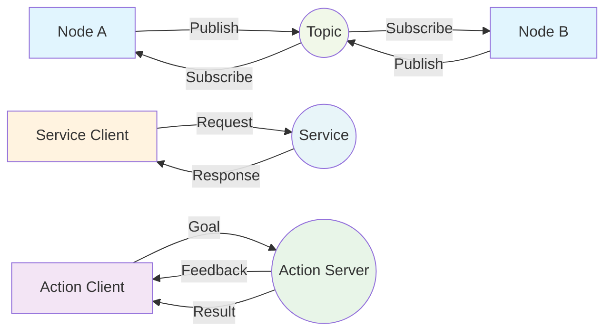

# Chapter 1: The Robotic Nervous System (ROS 2) - Introduction and Core Concepts

Welcome to Module 1! In this module, we'll dive into the heart of modern robotics: the Robot Operating System 2 (ROS 2). Think of ROS 2 as the nervous system of a robot, allowing different parts (like its brain, sensors, and motors) to communicate and work together.

## ROS 2 Architecture Diagram

This diagram shows the three main communication patterns in ROS 2: Topics (publish/subscribe), Services (request/response), and Actions (goal-based with feedback).

## What is ROS 2?

ROS 2 is a flexible framework for writing robot software. It's not an operating system like Windows or macOS, but rather a set of software libraries, tools, and conventions that simplify the task of creating complex robot applications.

## Core Concepts of ROS 2

ROS 2 organizes robot functions into several key concepts. Understanding these will help you build and control your own humanoid robots.

### 1. Nodes

Imagine a robot has many "mini-brains" each responsible for a specific task. These mini-brains are called **Nodes** in ROS 2.

*   **Example**: One node might control the robot's wheels, another might process camera images, and a third might plan the robot's path.
*   **Why Nodes?**: Breaking down tasks into smaller nodes makes robot software easier to manage, debug, and reuse.

### 2. Topics

How do these mini-brains (nodes) talk to each other? They use **Topics**. Topics are like specialized radio channels where nodes can send (publish) or receive (subscribe) messages.

*   **Publisher**: A node that sends information to a topic.
    *   **Example**: A camera node might *publish* images to an `/image_raw` topic.
*   **Subscriber**: A node that receives information from a topic.
    *   **Example**: An image processing node might *subscribe* to the `/image_raw` topic to get images.
*   **Messages**: The actual data sent over topics (e.g., an image, a sensor reading, a command).

### 3. Services

Sometimes, a node needs to request a specific action from another node and wait for a response. This is where **Services** come in. Services are like making a phone call: you request something, and you wait for an answer.

*   **Service Server**: The node that performs a task when requested.
    *   **Example**: A "move robot arm" service server node that moves the arm to a specific position.
*   **Service Client**: The node that requests the task to be performed.
    *   **Example**: A navigation node might act as a *service client* and *request* the "move robot arm" service to open a door.

### 4. Actions

**Actions** are similar to services, but for long-running tasks. Imagine asking a robot to clean a room. This takes a while! With actions, you can:

1.  Send a **goal** (e.g., "clean the kitchen").
2.  Receive **feedback** on its progress (e.g., "50% done").
3.  Get a **result** when it's finished (e.g., "kitchen is spotless!").
4.  Even **cancel** the task if needed.

*   **Action Server**: The node that executes the long-running task.
*   **Action Client**: The node that requests the long-running task.

### Summary

| Concept | Analogy | Purpose | Key Features |
| :------ | :------ | :------ | :----------- |
| **Node** | Mini-brain | Modular executable unit | Independent, reusable |
| **Topic** | Radio channel | One-way stream of data | Publishers, Subscribers, Messages |
| **Service** | Phone call | Request-response for short tasks | Client sends request, Server sends response |
| **Action** | Long phone call with updates | Goal-feedback-result for long tasks | Client sends goal, Server sends feedback/result, can be cancelled |

Understanding these core concepts will give you a strong foundation for building and controlling humanoid robots with ROS 2. In the next chapters, we'll dive deeper into how to use these concepts with practical Python examples.