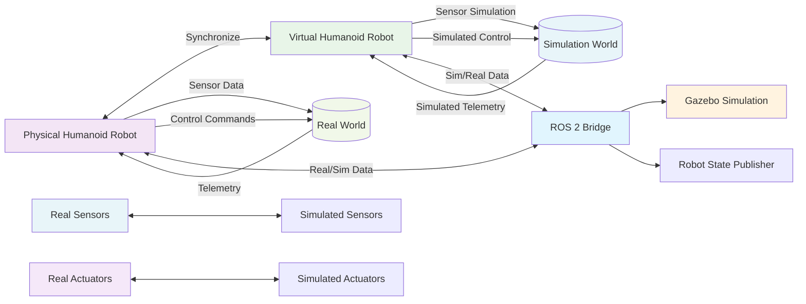

# Module 2: Digital Twin Simulation (Gazebo + Unity)

## Chapter 1: Humanoid URDF in Gazebo

## Digital Twin Architecture



This diagram shows how a digital twin creates a virtual replica of a physical robot, with synchronized data flow between real and simulated environments.

### Introduction

Welcome to Module 2! In this module, we'll learn about creating digital twins of humanoid robots using simulation software. A **digital twin** is like a virtual copy of a real robot. It helps us test and experiment with robots safely and efficiently without needing a physical robot. We will focus on using **Gazebo**, a powerful 3D robotics simulator, to bring our humanoid robot models to life.

### What is URDF?

Before we dive into Gazebo, let's revisit **URDF** (Unified Robot Description Format). As you learned in Module 1, URDF is an XML format used in ROS 2 to describe all the physical and kinematic properties of a robot. It defines:

*   **Links**: The rigid bodies of the robot (e.g., torso, upper arm, forearm, hand).
*   **Joints**: How these links are connected and how they can move relative to each other (e.g., revolute, prismatic, fixed).

For humanoid robots, URDF files can become quite complex, describing many links and joints to mimic the human body's articulation. These files are crucial for Gazebo to understand the robot's structure, appearance, and physical properties.

### Humanoid URDF Structure

A humanoid URDF typically includes:

*   **Base Link**: Often the torso or pelvis, from which other parts extend.
*   **Legs**: Multiple links and joints for thighs, shins, and feet.
*   **Arms**: Links for upper arms, forearms, and hands/grippers.
*   **Head**: A link for the head, often with a neck joint.
*   **Sensors**: Definitions for cameras, IMUs, LiDAR, etc., which we will cover in the next chapter.

Here's a simplified example of how you might structure a humanoid leg in URDF:

```xml
<robot name="humanoid_robot">
  <link name="torso_link">...</link>

  <joint name="torso_to_hip" type="revolute">
    <parent link="torso_link"/>
    <child link="hip_link"/>
    <origin xyz="0 0 -0.1" rpy="0 0 0"/>
    <axis xyz="0 0 1"/>
  </joint>

  <link name="hip_link">...</link>

  <joint name="hip_to_thigh" type="revolute">
    <parent link="hip_link"/>
    <child link="thigh_link"/>
    <origin xyz="0 0 -0.1" rpy="0 0 0"/>
    <axis xyz="0 1 0"/>
  </joint>

  <link name="thigh_link">...</link>

  <!-- ... more links and joints for shin, foot, etc. -->

</robot>
```

### Integrating URDF with Gazebo

Gazebo uses the URDF file to spawn your robot into the simulated world. When you launch a Gazebo simulation, you typically tell it which URDF file to load. Gazebo then:

1.  **Parses the URDF**: Reads the links, joints, visuals, and collisions.
2.  **Creates Physics Model**: Builds a physical representation of your robot, applying properties like mass, inertia, and friction defined in the URDF's `<inertial>` and `<collision>` tags.
3.  **Renders Visuals**: Displays the robot's visual appearance based on the `<visual>` tags.

To see your URDF robot in Gazebo, you usually use a `ros2 launch` file that starts Gazebo and loads your robot model. We'll explore this in detail in the project sections of this module.

### Summary

In this chapter, we learned about the importance of digital twins and how URDF files describe humanoid robots for simulation. We explored the common structure of humanoid URDFs, including links for the torso, legs, arms, and head. We also understood how Gazebo uses URDF to create a physical and visual representation of our robot in a simulated environment.

### Quiz Questions

1.  What is a digital twin, and why is it useful in robotics?
2.  What does URDF stand for, and what two main components does it describe?
3.  List three common parts of a humanoid robot that would be defined as links in a URDF.
4.  How does Gazebo use a URDF file to simulate a robot?
5.  What kind of file is typically used to launch a URDF robot in Gazebo?
