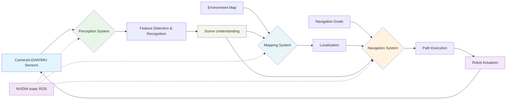

# Chapter 1: Perception, Mapping, and Navigation

## Introduction

Welcome to Module 3 of our Physical AI & Humanoid Robotics educational book! In this module, we'll explore the "AI-Robot Brain" using NVIDIA Isaac and Isaac ROS. This is where your robot transitions from basic control and simulation to intelligent autonomous behavior.

In this first chapter, we'll cover the fundamental concepts of perception, mapping, and navigation that form the core of an intelligent robot's "brain."

## AI-Robot Brain Architecture

This diagram shows how the AI-Robot Brain integrates perception, mapping, and navigation systems to create intelligent autonomous behavior.

## Understanding Robot Perception

### What is Robot Perception?

Robot perception is the process by which a robot interprets sensory data from its environment to understand and interact with the world around it. Think of it as the robot's "senses" - just like humans use eyes, ears, and touch to understand their surroundings, robots use cameras, LiDAR, IMU sensors, and other devices.

### Key Components of Robot Perception

1. **Sensors**: The input devices (cameras, LiDAR, etc.)
2. **Processing**: Algorithms that interpret sensor data
3. **Understanding**: Higher-level interpretation of the environment
4. **Action**: Using perception to guide robot behavior

### Perception in Humanoid Robots

For humanoid robots, perception is especially important because they need to navigate and interact in human environments. This means:
- Recognizing human-made objects and structures
- Understanding human gestures and behaviors
- Navigating spaces designed for humans
- Avoiding obstacles at human walking speeds

## Environmental Mapping

### What is Mapping?

Mapping is the process of creating a representation of the robot's environment. This map serves as a reference for navigation and can be used for planning, localization, and decision-making.

### Types of Maps

1. **Occupancy Grid Maps**: Divide space into discrete cells that are either occupied or free
2. **Topological Maps**: Represent the environment as nodes (locations) and edges (connections)
3. **Metric Maps**: Include precise geometric information about the environment
4. **Semantic Maps**: Include object labels and contextual information

### Creating Maps with Sensor Data

Maps are built using sensor data collected as the robot moves through its environment. The process involves:
- Collecting sensor readings from various positions
- Estimating the robot's location relative to the map
- Integrating new sensor data with existing map information
- Handling sensor noise and uncertainty

## Navigation Fundamentals

### What is Robot Navigation?

Navigation is the ability of a robot to move autonomously from one location to another while avoiding obstacles. It involves three key components:

1. **Localization**: Determining where the robot is in the environment
2. **Path Planning**: Finding a route from the current location to the goal
3. **Path Execution**: Moving the robot along the planned path

### Navigation Challenges for Humanoid Robots

Humanoid robots face unique navigation challenges:
- **Stability**: Must maintain balance while moving
- **Foot placement**: Requires careful planning of where to place feet
- **Dynamic movement**: More complex than wheeled robots
- **Human-aware navigation**: Should move in ways that are predictable to humans

## Introduction to NVIDIA Isaac and Isaac ROS

### What is NVIDIA Isaac?

NVIDIA Isaac is a comprehensive robotics platform that includes:
- Hardware (Isaac robotics platforms)
- Software (Isaac ROS packages)
- Tools (Isaac Sim, Isaac Apps)
- AI frameworks optimized for robotics

### Isaac ROS: Accelerating Robotics with AI

Isaac ROS brings NVIDIA's GPU-accelerated AI computing to ROS 2, offering:
- High-performance perception algorithms
- GPU-accelerated processing
- Deep learning integration
- Real-time performance for robotics applications

### Key Isaac ROS Features

1. **Hardware Acceleration**: Leverage NVIDIA GPUs for faster processing
2. **Pre-trained Models**: Use AI models trained for robotics tasks
3. **Modular Design**: Integrate components as needed
4. **ROS 2 Compatibility**: Works seamlessly with existing ROS 2 ecosystem

## Perception Pipeline Overview

A typical perception pipeline in Isaac ROS includes:

1. **Sensor Interface**: Collect data from cameras, LiDAR, IMU
2. **Preprocessing**: Clean and format sensor data
3. **Feature Extraction**: Identify relevant features in the data
4. **Object Detection**: Recognize and classify objects
5. **Scene Understanding**: Interpret the environment contextually
6. **Output**: Provide processed information to other systems

## Mapping and Navigation Integration

The perception, mapping, and navigation systems work together:

- Perception provides information about obstacles and landmarks
- Mapping creates and updates the environmental representation
- Navigation uses the map and perception data to plan and execute movement
- The robot's position is continuously updated (localization)

## What's Next?

In the upcoming chapters, we'll dive deeper into specific technologies:
- Chapter 2: Visual SLAM for creating maps while localizing
- Chapter 3: Nav2 for advanced navigation with humanoid robots
- Chapter 4: Synthetic data generation for AI training

These technologies form the foundation of the AI-Robot Brain that will make your humanoid robot intelligent and autonomous.