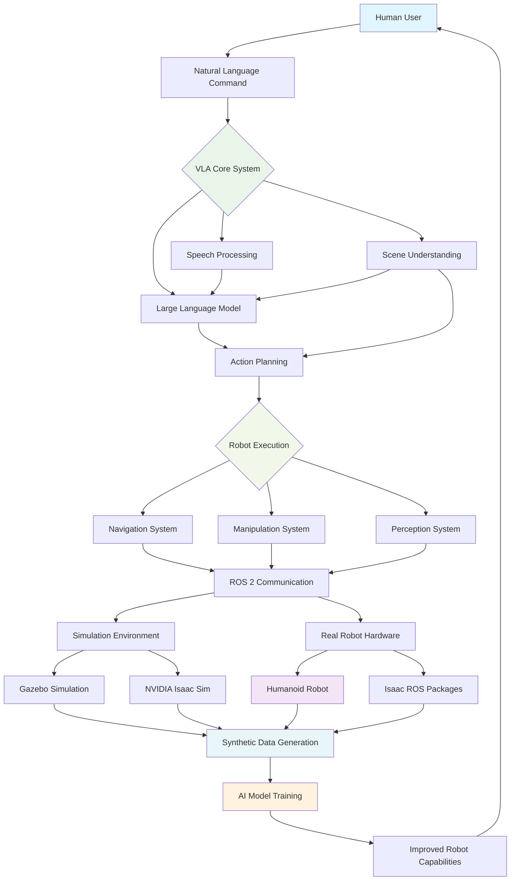

# Chapter 1: Vision-Language-Action (VLA) Architecture

## Introduction to Vision-Language-Action Robotics

Welcome to Module 4, the capstone module of our Physical AI & Humanoid Robotics educational book! In this module, we'll explore Vision-Language-Action (VLA) Robotics, which represents the cutting edge of human-robot interaction. VLA systems enable robots to understand natural language commands, interpret visual scenes, and execute corresponding physical actions—a crucial capability for humanoid robots that need to interact naturally with humans.

## VLA System Architecture

This diagram shows the complete VLA architecture integrating vision, language, and action systems with the broader robotics ecosystem. The system is organized into logical subgroups to make it easier to understand the flow from human interaction to robot execution and back.

## What is Vision-Language-Action (VLA)?

Vision-Language-Action (VLA) refers to an integrated robotic system architecture that combines three key modalities:

1. **Vision**: The ability to perceive and understand visual information from the environment
2. **Language**: The ability to process and understand natural language commands
3. **Action**: The ability to execute physical actions in response to vision and language inputs

VLA systems represent a significant advancement over traditional robotics approaches by creating a unified framework where these modalities work together seamlessly.

## The Need for VLA in Humanoid Robotics

### Human-Like Interaction

Humanoid robots are designed to operate in human environments and interact with humans naturally. VLA systems enable this by:

- Understanding spoken commands in natural language
- Interpreting visual scenes the way humans do
- Executing actions that are intuitive and predictable to humans
- Providing a more natural interface than traditional button-based or app-based controls

### Flexibility and Adaptability

VLA systems provide unprecedented flexibility:

- **Ad-hoc Tasking**: Robots can be commanded to perform tasks they weren't specifically programmed for
- **Context Awareness**: Actions can be adapted based on visual context
- **Learning from Interaction**: Systems can improve through natural human-robot interaction

## VLA Architecture Overview

### Core Components

A typical VLA architecture consists of:

1. **Perception System**: Processes visual input and extracts relevant information
2. **Language Understanding**: Interprets natural language commands and queries
3. **Action Planning**: Determines appropriate physical actions based on vision and language
4. **Execution System**: Carries out planned actions on the physical robot
5. **Integration Layer**: Coordinates between all components in real-time

### System Integration

The power of VLA lies in the tight integration between these components:

- Visual information can disambiguate language commands
- Language commands can focus visual attention on relevant objects
- Actions are planned based on both visual context and linguistic intent
- Feedback from execution can refine both vision and language understanding

## Key Technologies in VLA

### Large Language Models (LLMs)

Large Language Models serve as the "brain" for language understanding in VLA systems:

- **Command Interpretation**: Converting natural language to robot actions
- **Reasoning**: Understanding context, constraints, and implications
- **Dialogue Management**: Handling multi-turn conversations

### Vision Transformers and Multimodal Models

Modern vision systems in VLA use advanced architectures:

- **Visual Scene Understanding**: Identifying objects, their properties, and spatial relationships
- **Object Detection and Segmentation**: Locating relevant objects in the environment
- **Multimodal Fusion**: Combining visual and linguistic information

### Action Space Representation

VLA systems must represent and plan actions effectively:

- **Discrete Actions**: High-level commands like "pick up" or "move to"
- **Continuous Control**: Low-level motor commands for precise manipulation
- **Hierarchical Planning**: Combining high-level goals with low-level execution

## VLA Pipeline Architecture

### The Standard VLA Flow

The typical VLA processing pipeline follows this sequence:

1. **Input Reception**: Receive visual data (images, video) and language commands
2. **Modality Processing**: Process each modality separately using specialized models
3. **Fusion**: Combine visual and linguistic information
4. **Reasoning**: Apply logical reasoning to determine appropriate response
5. **Action Planning**: Generate a sequence of actions to achieve the goal
6. **Execution**: Execute actions on the physical robot
7. **Feedback**: Monitor execution and adjust as needed

### Real-Time Considerations

VLA systems must operate in real-time for natural interaction:

- **Latency Requirements**: Response times under 1-2 seconds for natural interaction
- **Streaming Processing**: Handling continuous video and audio streams
- **Resource Management**: Balancing computational demands with real-time requirements

## VLA in Humanoid Robot Control

### Natural Language Commands

Humanoid robots with VLA capabilities can respond to commands like:
- "Please bring me the red cup from the table"
- "Move to the kitchen and wait by the refrigerator"
- "Help me find my keys"

### Scene Understanding

The robot must understand:
- **Object Properties**: Colors, shapes, sizes, materials
- **Spatial Relationships**: "on the table", "next to the chair", "in front of"
- **Functional Relationships**: What objects are for, how they can be used
- **Human Intent**: What the human is trying to achieve

### Action Selection and Execution

Based on vision and language input, the robot must:
- **Select Appropriate Actions**: Choose the right sequence of movements
- **Plan Safe Paths**: Navigate around obstacles while maintaining balance
- **Execute Precisely**: Perform manipulations with appropriate force and accuracy
- **Handle Failures**: Recognize when actions fail and adapt accordingly

## Challenges in VLA Implementation

### Technical Challenges

1. **Multimodal Alignment**: Ensuring vision and language refer to the same entities
2. **Real-Time Processing**: Meeting computational demands while maintaining responsiveness
3. **Robustness**: Handling variations in lighting, language, and environment
4. **Scalability**: Managing increasing complexity as capabilities grow

### Human-Robot Interaction Challenges

1. **Ambiguity Resolution**: Handling vague or ambiguous commands
2. **Error Recovery**: Gracefully handling misunderstandings
3. **Social Norms**: Following appropriate social conventions
4. **Trust Building**: Creating reliable and predictable behavior

## VLA Architecture Patterns

### Centralized vs. Distributed

**Centralized Architecture**:
- All processing happens in a central unit
- Simpler coordination but potential bottleneck
- Better for complex reasoning tasks

**Distributed Architecture**:
- Processing distributed across multiple units
- Better for real-time performance
- More complex coordination requirements

### End-to-End vs. Modular

**End-to-End Training**:
- Single model learns entire VLA pipeline
- Potentially more efficient and coordinated
- Difficult to debug and modify

**Modular Approach**:
- Separate models for vision, language, action
- Easier to develop and maintain
- More flexible for customization

## Looking Ahead

This chapter has introduced the fundamental concepts of VLA architecture. In the following chapters, we'll dive deeper into:

- Chapter 2: The Speech → LLM → Action pipeline
- Chapter 3: Scene understanding and visual processing
- Chapter 4: Natural language robot control

These components will come together in the capstone project, where you'll implement a complete VLA system for humanoid robot control, representing the culmination of all the concepts learned throughout this book.